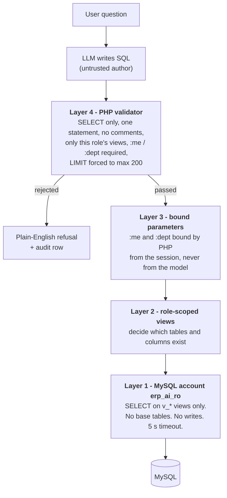

# Demo ERP + AI assistant

A chat assistant bolted onto a **copy of a real training ERP database** (1,288 tables, a
software company with 34 active employees). It exists to demonstrate one architecture:

> An employee asks a question in plain English. The AI writes the SQL **itself** (there
> is no library of pre-written queries), but that SQL can only ever run against
> **role-scoped, read-only database views**, through a MySQL account that holds
> `SELECT` on those views **and nothing else**.

Two kinds of question work:

| Kind | Example | What happens |
|---|---|---|
| Information | "What's our leave policy?" | Answered from the company knowledge base. No database query. |
| Data | "How many leave days do I have left?" | The AI checks the user's role, writes SQL scoped to what that role may see, the server validates and runs it. |

And, most importantly, a **refusal** is a normal, clean outcome: an employee asking for
salary data gets *"You're not authorised to access salary information."* The rest of
this document explains why that refusal holds even if the AI misbehaves.

Stack: Yii 2 (basic template), PHP 8, MySQL 8. No Composer packages beyond Yii itself.
AI calls are plain `curl`. No LLM SDK, no vector database, no Node.

---

## Contents

1. [The security model](#the-security-model-four-layers)
2. [Why two MySQL accounts](#why-two-mysql-accounts)
3. [Why views cannot be parameterised, and how :me / :dept solve it](#why-views-cannot-be-parameterised-and-how-me--dept-solve-it)
4. [The data](#the-data-a-copy-of-the-training-erp) and [roles](#the-five-roles)
5. [Request flow](#request-flow)
6. [Why no vector store](#why-no-vector-store)
7. [Known limitations](#known-limitations)
8. [Setup](#setup)
9. [Demo script](#demo-script)
10. [Verifying it yourself](#verifying-it-yourself)
11. [Where things live](#where-things-live)
12. [The same chatbot inside the company ERP](#the-same-chatbot-inside-the-company-erp)

---

## The security model: four layers

Each layer assumes the one above it has failed.



### Layer 1: two MySQL accounts

| Account | Privileges | Used by |
|---|---|---|
| `erp_app` | All privileges on the `erp_training` schema | The application itself, and migrations |
| `erp_ai_ro` | `SELECT` on the 25 `v_*` views. **Nothing else.** | Only the code path that executes AI-generated SQL |

This is the output of `SHOW GRANTS FOR 'erp_ai_ro'@'127.0.0.1'`:

```
GRANT USAGE ON *.* TO `erp_ai_ro`@`127.0.0.1`
GRANT SELECT ON `erp_training`.`v_dept_attendance_monthly` TO `erp_ai_ro`@`127.0.0.1`
GRANT SELECT ON `erp_training`.`v_dept_employees` TO `erp_ai_ro`@`127.0.0.1`
... (one line per view, 25 in total) ...
GRANT SELECT ON `erp_training`.`v_team_members` TO `erp_ai_ro`@`127.0.0.1`
```

`USAGE` means "may log in"; it grants nothing. There is no line for any of the ERP's
**1,288 base tables** (`personnel_basic_info`, `salary_info`, the login table with its password
hashes, accounting, sales...), none for the internal `ai_*` helper views, and no `INSERT`,
`UPDATE`, `DELETE`, `CREATE`, `DROP`, `FILE` or `PROCESS` anywhere. The AI can reach 25
views out of 1,300+ objects.

**How can erp_ai_ro read a view over tables it cannot touch?** MySQL views default to
`SQL SECURITY DEFINER`. A view runs with the privileges of the user who **created** it
(`erp_app`), not the user who **queries** it. So `erp_ai_ro` can read exactly what each
view exposes, and nothing more. That one MySQL behaviour is what makes this design work.
The migration sets `SQL SECURITY DEFINER` explicitly rather than relying on the default.

In the application these are two Yii connection components, `db` and `dbAi`
([config/db.php](config/db.php), [config/db-ai.php](config/db-ai.php)). `dbAi` also sets,
per session:
- `MAX_EXECUTION_TIME = 5000` (any query running longer than 5 seconds is killed);
- `transaction_read_only = 1` (belt and braces; the grant is the real control);
- real server-side prepared statements, so parameters are bound by MySQL rather than
  pasted into the SQL text.

### Layer 2: role-scoped views

Views decide **which tables and which columns** a tier can reach. There is one set of
views per *authority tier*, not one per employee.

Salary lives in its own ERP table (`salary_info`), and **only three views join to it**:
`v_hr_employees_full`, `v_hr_payroll` and `v_exec_payroll_summary`. Employee, manager and
department-head views never touch that table, so there is no salary column sitting next
to harmless columns waiting to be selected by mistake.

Some columns are **never exposed by any view, whatever the tier**: passwords, tokens and OTPs,
NID / TIN / CV / photo file paths, date of birth, religion, personal phone numbers, and bank
account numbers (even HR's payroll view leaves them out). The views also clean the ERP's real
data: zero or 1970 dates, leave rows for employees who do not exist, numeric leave-type codes
(turned into names) and attendance flags (turned into one readable status).

### Layer 3: bound parameters for row scoping

A view decides columns. It cannot decide *whose* rows. See
[the next section](#why-views-cannot-be-parameterised-and-how-me--dept-solve-it).

### Layer 4: the query validator

[components/ai/SqlValidator.php](components/ai/SqlValidator.php) runs before **every**
execution. It tokenises the SQL properly (string literals, quoted identifiers, numbers,
keywords and placeholders are separated first), so it is not fooled by, for example, the
text `FROM salaries` inside a quoted string. A query is rejected unless **all** of these
hold:

- Exactly one statement. An optional trailing `;` is allowed; any other `;` is rejected.
- It begins with `SELECT`. `INSERT`, `UPDATE`, `DELETE`, `DROP`, `ALTER`, `CREATE`,
  `TRUNCATE`, `GRANT`, `SET`, `CALL`, `LOAD`, `HANDLER`, `REPLACE`, `WITH`, `TABLE`,
  `INTO` and similar are rejected wherever they appear.
- No comments (`--`, `#`, `/* */`), no `@variables`, no `?` placeholders.
- Every table named after `FROM`, `JOIN` or `,` is on **this role's allowlist**.
  Schema-qualified names, `INFORMATION_SCHEMA`, `mysql.*`, table functions and
  parenthesised table lists are rejected.
- Timing and environment functions (`SLEEP`, `BENCHMARK`, `LOAD_FILE`, `USER()`...) are
  rejected.
- A self-scoped view must be filtered `employee_id = :me` (a team view,
  `manager_id = :me`), and a department view `department_id = :dept`.
- A `LIMIT` must be present. If it is missing, `LIMIT 200` is appended; if it is larger
  than 200, it is rewritten down to 200.

On rejection the user sees a plain-English sentence such as *"You're not authorised to
access salary information."* The technical reason goes to the audit log only. Raw SQL
errors are never shown to the user, and never sent back to the model either (it gets a
generic hint when a query needs fixing).

The single source of truth for "which role may use which view, with which scope" is
[config/access-map.php](config/access-map.php). Both the validator and the prompt builder
read it.

---

## Why two MySQL accounts

Because the AI's SQL is **untrusted input**, even after validation. The validator is PHP
code written for this demo, and it could have a bug. The MySQL grant is enforced by the
database server, and it holds no matter what PHP does.

With one account, a validator bug would be a data breach. With two, a validator bug means
MySQL answers `ERROR 1142: SELECT command denied to user 'erp_ai_ro' for table
'salary_info'`. You can see this directly (the command below skips the validator on purpose):

```
php yii security/raw "SELECT AVG(gross_salary) FROM salary_info"
  As erp_ai_ro@127.0.0.1, validator BYPASSED:
  MySQL REFUSED it: SELECT command denied to user 'erp_ai_ro'@'localhost' for table 'salary_info' (error 1142)
```

---

## Why views cannot be parameterised, and how :me / :dept solve it

A MySQL view takes no parameters. `v_my_leave_balance` contains **every** employee's
balance rows: nothing inside a view definition can mean "the person who is asking". So
the two jobs are split:

| Job | Done by |
|---|---|
| Which **columns and tables** a tier may see | The **view** (for example, no salary column in any employee-tier view) |
| Which **rows** belong to the asker | A **bound parameter** from the logged-in session |

The model is told to write placeholders, never ids:

```sql
SELECT leave_type, remaining
FROM v_my_leave_balance
WHERE employee_id = :me AND year = YEAR(CURDATE())
```

PHP then binds `:me` to the logged-in employee's id and `:dept` to their department id,
both **taken from the server-side session** (the `Employee` record Yii loads from the
session cookie). The value never comes from anything the model produced and is never
interpolated into the SQL string. The model is never even told the user's id.

**Defence in depth.** Requiring `:me` to be present is not enough by itself:
`WHERE employee_id = :me OR 1=1` contains `:me` and would still return everyone's rows.
So the validator also rewrites every scoped view into a derived table that applies the
scope itself:

```sql
-- what the model wrote
SELECT DISTINCT employee_id FROM v_my_attendance WHERE employee_id = :me OR 1=1

-- what actually runs on dbAi (the model's WHERE is kept, but no longer matters)
SELECT DISTINCT employee_id
FROM (SELECT * FROM `v_my_attendance` WHERE `employee_id` = :me) AS `v_my_attendance`
WHERE employee_id = :me OR 1=1 LIMIT 200
```

Whatever the model writes, a self-scoped view only ever returns the asker's own rows.
The test suite checks exactly this case.

---

## The data: a copy of the training ERP

The chatbot runs on `erp_training`, an import of `trainingclouderp_training_db.sql`, a copy
of the company's real training ERP. The dump file is **gitignored and never committed**: it
contains personal data and password hashes, and this repository is public.

- **What's in it:** a MariaDB 10.11 dump with 1,288 tables and about 565,000 rows covering HR,
  accounting, sales, CRM, a hotel module and more. The chatbot covers **HR** for now:
  employees, leave, attendance, salary and the directory.
- **Import:** `php yii setup/import-training <mysql-root-password>` converts the three
  MariaDB-only constructs MySQL 8 rejects (duplicate ENUM values, `DATE DEFAULT
  current_timestamp()`, InnoDB strict row-size checks), then streams the dump in. The ERP's
  own tables are otherwise untouched.
- **App-owned tables:** everything the chatbot adds is prefixed `ai_`: tier assignments,
  demo passwords, the knowledge base, the audit log, internal helper views. It can never
  collide with the ERP, which already has tables such as `company_info` and `employees`.
- **Identity:** an employee is a row of `personnel_basic_info` (key `pbi_id`, which is `:me`).
  Sign-in uses the ERP login table (`user_activity_management`), linked by `PBI_ID`. Only
  logins of **in-service** employees can sign in.

**Findings worth knowing** (from analysing the dump):
- **Passwords:** 74 of 76 ERP passwords are **unsalted MD5** and **2 are stored in
  plaintext**. The chatbot never reads that column. For the demo, it issues its own bcrypt
  passwords, and it accepts the ERP's MD5 hashes only as a fallback.
- **Access levels:** the ERP's own access `level` is a module privilege (Report Viewer,
  Purchase Officer...), and **52 of 76 logins are "Supreme Administrator"**. So it cannot be
  used to decide who sees what (see below).
- **Missing roles:** department heads are never recorded; the CEO and MD records are "Not In
  Service"; and no active employee works in HR.
- **Messy data:** the reporting chain has loops (36 employees sit in a circular chain, and one
  is their own manager). There are zero dates and leave rows for employees who don't exist.

## The five roles

These are five genuinely different scopes, not five labels on the same query.

| Role | Rows | Salary? | Views |
|---|---|---|---|
| `employee` | Own rows only (`employee_id = :me`) | No | directory + `v_my_*` |
| `manager` | + their reporting line (`supervisor_id = :me`) | No | + `v_team_*` |
| `dept_head` | + the whole department they head (`department_id = :dept`) | No | + `v_dept_*` (incl. leave summary) |
| `hr` | All employees | **Yes** | directory + `v_my_*` + `v_hr_*` |
| `ceo` | Everything HR sees + own reporting line | **Yes** | + `v_exec_*` company-wide summaries |

**How a person's tier is decided** ([components/RoleResolver.php](components/RoleResolver.php)):
it's worked out on the server, on every request, from org data. It is never taken from the
request, and never from the ERP's `level` field. The first rule that matches wins:

1. **An explicit assignment** in `ai_role_assignment` gives `ceo`, `hr` or `dept_head`.
   Authority tiers are an HR decision, so they're recorded rather than guessed from job
   titles. The demo assigns: the CTO → `ceo` (top active executive); the CTO (Operation) →
   `dept_head` of Engineering; and a clearly labelled demo HR person → `hr`.
2. **Line manager** (`incharge_id` or `incharge_id_2`) of at least one in-service employee →
   `manager`.
3. Everyone else → `employee`.

**Reporting lines:** the team views use a recursive, **cycle-safe** chain. It follows both
supervisor columns, is capped at 6 levels, and guards against the ERP's circular chains. Each
row is an (employee, supervisor) pair with a `depth`, where 1 means a direct report. So one
predicate, `supervisor_id = :me`, covers the whole reporting line. The validator enforces it,
and the server wraps the view so that `OR 1=1` cannot widen it.

**Small groups:** the executive payroll summary shows pay figures only for groups of **5 or
more people**. Smaller departments show a headcount and `suppressed = yes`.

Roles live in a small app table plus the PHP map in
[config/access-map.php](config/access-map.php). Yii's RBAC is deliberately not used,
because the real boundary is the MySQL grant.

---

## Request flow

`POST /index.php?r=chat/ask` → [controllers/ChatController.php](controllers/ChatController.php)
→ [components/ai/ChatService.php](components/ai/ChatService.php)

1. **Who is asking** comes from the session. The request body carries only the question
   text; the tests confirm that adding `"role": "ceo"` to the body changes nothing.
2. **The system prompt is built for that role**
   ([PromptBuilder](components/ai/PromptBuilder.php)). It contains:
   - all `ai_knowledge_base` rows (generated from the ERP's own leave, schedule and holiday tables);
   - the column list of **only** the views this role may use;
   - the SQL rules: `SELECT` only, one statement, `:me` / `:dept`, `LIMIT`, MySQL dialect.

   An employee's prompt contains no salary column and no HR view, so the model cannot even
   see what to ask for. (`php yii security/prompt tanvir` prints the exact prompt.)
3. **The model is called with two tools**: `getUserRole()` and `runReadOnlyQuery(sql)`.
4. **No tool call** means an information answer. If the model instead answers
   `ACCESS_DENIED: <subject>` (it saw no permitted view for the request), the server turns
   that into the standard refusal. No SQL was ever generated.
5. **`getUserRole`** returns the session role. To be clear, this is **not a security
   control**. The backend already knows the role and enforces it in layers 1 to 4. The tool
   exists so the role check is visible and traceable in the demo, and because in production
   the chatbot may run as a separate service that genuinely needs to ask.
6. **`runReadOnlyQuery`** validates, binds `:me` / `:dept` from the session, and executes
   on `dbAi`. The rows go back to the model, which phrases the answer. A **refusal ends the
   turn immediately**, and the wording comes from the server, not the model. A query that
   fails to execute (for example an unknown column) gets a generic hint and up to 2 retries.
7. **Exactly one `chat_audit_log` row per turn**, whatever happened: `info`, `data`,
   `denied` or `error`, with the generated SQL, denial reason, row count, latency, provider
   and model. `employee_id` has no foreign key, so audit rows survive employee deletion.

**AI provider.** Primary is Google Gemini (`gemini-2.5-flash`, free tier). Fallback is
Groq `openai/gpt-oss-120b` (free, OpenAI-compatible API). The choice is one line in
`config/ai.php`. Temperature is 0, so the same question gives the same SQL on the
projector. The Gemini client uses the REST `generateContent` API and sends the model's
previous turn back exactly as received (including `thoughtSignature`), which is required
for newer Gemini models' function calling.

---

## Why no vector store

The knowledge base is about 15 short rows. Putting all of it in the prompt is **cheaper,
simpler and more accurate** than embeddings at this size: nothing to index, nothing to
tune, and no retrieval step that can miss the relevant paragraph.

The chat interface does not depend on how knowledge is retrieved. Swapping in a vector
store later (when the knowledge base is thousands of documents) would change only
`PromptBuilder::knowledgeBase()`, not the chat flow, the tools, or the security layers.

---

## Known limitations

Stated plainly rather than hidden:

1. **Free-tier AI data use. This now matters.** On free tiers, Google (and Groq) may use
   submitted prompts and responses to improve their models. The chatbot now runs on a
   **copy of the real training ERP**, so the rows a question returns are sent to the
   provider: names, leave reasons, and for HR and executives, salaries. Before using it with
   anything beyond a controlled demo, move to a paid tier with a no-training / data-processing
   agreement, or a self-hosted model.
2. **Small-group aggregates.** "Average salary" over one or two people reveals their pay.
   The executive payroll summary now **suppresses pay figures for groups under 5**, and most
   departments here have 1 to 3 people. HR's own views are row-level by design (HR may see
   individual salaries), so the rule applies only to the summaries.
3. **Tier separation between views is enforced by the validator, not by MySQL.** There is
   one `erp_ai_ro` account for all roles, holding `SELECT` on every view. MySQL guarantees
   that **no role can reach a base table or write anything**; it is the PHP validator that
   stops, say, an employee's query from using `v_hr_payroll`. Hardening step: one MySQL
   account per tier (`erp_ai_employee`, `erp_ai_hr`, ...), each granted only its own
   views, so that the database enforces that boundary too.
4. **The validator is a conservative allowlist, not a full SQL parser.** It rejects
   anything it does not understand (CTEs, parenthesised table lists, variables...). Rare
   but legitimate queries may be refused. That trade-off is intentional.
5. **Prompt injection.** A user can try to talk the model into writing other SQL. That can
   change *which* SQL is attempted, but not *what can run*: layers 1 to 4 do not trust the
   model at all. The test suite includes a deliberately malicious scripted "model".
6. **The demo role switcher** (become any user without a password) is a demo convenience
   controlled by `params['demoRoleSwitcher']` in [config/params.php](config/params.php).
   Turn it off for anything else.
7. **Gemini model availability.** Google now restricts `gemini-2.5-*` to accounts that
   have used it before. If a new key gets "model not available", set the model in
   `config/ai.php` to `gemini-3.8-flash`, or switch `provider` to `groq`.
8. **Rate limits.** Free tiers throttle. A throttled request produces a clean "try again
   in a minute" message and an `error` audit row, not a crash.

---

## Setup

Prerequisites: PHP 8.x with `pdo_mysql`, `mbstring`, `openssl`, `curl`, `intl`; MySQL 8;
Composer; and the dump file `trainingclouderp_training_db.sql` in the project root. The dump
is **gitignored**; copy it to each machine separately.

```bash
# 1. Dependencies (Yii only)
composer install

# 2. Local settings. In THIS demo repo, config/db-local.php and config/ai.php are committed
#    on purpose so every device can pull and run. The AI API KEY is never committed:
cp config/ai-local.php.example config/ai-local.php     # paste your Gemini (or Groq) API key

# 3. Everything database-related, in one go (~7 minutes):
#    erp_app account -> import the training dump into erp_training -> migrations
#    (ai_* tables, demo people + passwords, views, knowledge base) -> erp_ai_ro grants
php yii setup/database <mysql-root-password>

# 4. Run
php yii serve localhost:8080
#    open http://localhost:8080 - every demo login's password is Demo@1234
```

Re-running `setup/database` (or `php yii setup/import-training <root-password>` followed by
`php yii migrate`) rebuilds `erp_training` from the dump from scratch.

**`localhost` vs `127.0.0.1`.** MySQL treats `'user'@'localhost'` and
`'user'@'127.0.0.1'` as **different accounts**. Both SQL scripts create both. Use
whichever host string actually authenticates in `db-local.php` (here it is `127.0.0.1`,
over TCP). If you get "access denied" over TCP with a correct password, look for an
anonymous `''@'localhost'` row in `mysql.user` taking precedence.

**Windows / HTTPS.** PHP on Windows often has no CA bundle, which breaks HTTPS to the AI
provider. The client uses the Windows certificate store (`CURLSSLOPT_NATIVE_CA`) and keeps
TLS verification on. Set `caBundle` in `config/ai.php` if you need a specific
`cacert.pem`.

---

## Demo script

All five must work end to end. `php yii verify/demo` runs them live against the
configured provider.

**The chat is a floating widget.** After signing in you land on the "Demo Chatbot Testing
Interface" dashboard. Click the round **chat button in the bottom-right corner** to open a
Messenger-style chat window, and click it again (or press Esc) to close it. The window is on
every page, keeps the conversation while it is closed and when you move between pages, and
starts fresh for each user: switching user or signing out clears it. The header has **SQL**
(show the generated SQL), **expand** (a wider window for the projector), **clear** and
**close**.

**Demo logins** (password `Demo@1234` for all; also in the Switch user menu):

| Username | Person | Tier |
|---|---|---|
| `bimol` | Bimol Chandra Das, Chief Technical Officer | Executive (assigned) |
| `hr.demo` | Farzana Rahman (Demo HR), HR Manager, created for the demo | HR (assigned) |
| `1005` | Payer Alam Rony, CTO (Operation) | Department Head of Engineering (assigned) |
| `1002` | Kawsar Mahmud, Sr. Project Manager | Manager (3 direct reports, derived) |
| `tanvir` | Tanvir Ahmmed, Jr. Software Engineer | Employee |
| `1954` | Md Nizam Uddin (Tanim), Software Engineer | Employee |

| # | Sign in as | Ask | Expected |
|---|---|---|---|
| 1 | `tanvir` (Employee) | "what's our leave policy?" | **Info path.** From the knowledge base (built from the ERP's leave types): Casual 15 days, Sick 6... No SQL. |
| 2 | `tanvir` | "how many casual leave days do I have left?" | **Data path.** `v_my_leave_balance`, `:me` bound to 1960. 13 of 15 left. |
| 3 | `tanvir` | "what's the average salary in engineering?" | **Refused**: "You're not authorised to access salary information." |
| 4 | `1005` (Dept Head) | "who in my department has pending leave?" | **Data path.** `v_dept_leave_requests`, `:dept` bound to 10 (Engineer). |
| 5 | `hr.demo` (HR) | the exact question from #3 | **Answered**: about BDT 66,429 average gross monthly salary (17 engineers with a salary on record). |

Bonus: `1002` (Manager) asks "who on my team has pending leave?". The answer covers his
reporting line only (`supervisor_id = :me`).

**#3 and #5 are the same sentence with different outcomes. That is the whole point.**

Suggested talking points for #3:

1. Tick **SQL** in the chat window's header (and click **expand** so it is readable). The
   refusal card says *"The model found no permitted view for this and generated no SQL"*.
2. Open **Security test bench** as tanvir and expand "System prompt the AI receives for this
   role". There is no salary column in it anywhere: the model cannot write a query for
   something it was never told exists.
3. On the bench, run the preset **"Average salary in Engineering"**. Even if the model
   *had* guessed the HR view name, the validator refuses it.
4. In a terminal, `php yii security/raw "SELECT AVG(gross_salary) FROM salary_info"`. Even if the
   validator had a bug, **MySQL itself** refuses (error 1142).
5. Show `SHOW GRANTS FOR 'erp_ai_ro'@'127.0.0.1';`: only view grants.
6. Open **Audit log**: the refusal was recorded with its reason.

Use the **Switch user** menu (top right) to change identity in two clicks.

---

## Verifying it yourself

Repeatable checks, one per build phase. Start the server first (`php yii serve`); the
HTTP checks drive it like a browser.

```bash
php yii verify/all      # phases 1-6 (151 checks), no AI calls (the AI is replaced by a scripted stand-in)
php yii verify/phase4   # just the permission layer: allowed / refused / :me / LIMIT / injection cases
php yii verify/demo     # the five demo questions LIVE against the configured AI provider

php yii security/prompt tanvir                                     # exact system prompt for a user
php yii security/check  tanvir "SELECT ... :me ..."                # validator + dbAi as that user
php yii security/raw    "SELECT AVG(gross_salary) FROM salary_info" # bypass validator: MySQL alone
```

`verify/phase5` includes a **malicious scripted model** that tries base tables, guessed HR
views, `OR 1=1`, missing `:me` and `DELETE`. All are refused or neutralised by the server.

---

## Where things live

| Path | What |
|---|---|
| [config/access-map.php](config/access-map.php) | Role → allowed views → required scope. Single source of truth. |
| [config/db.php](config/db.php), [config/db-ai.php](config/db-ai.php) | The two connections (`db` = erp_app, `dbAi` = erp_ai_ro) |
| `config/db-local.php`, `config/ai.php` | DB passwords and AI settings (committed for this demo); API keys go in the gitignored `config/ai-local.php` |
| [sql/](sql/) | Bootstrap and restricted-account scripts (run by `php yii setup/database`) |
| [migrations/training/](migrations/training/) | `ai_*` tables, demo people + passwords, the 25 views (+6 helpers), knowledge base (history table `ai_migration`) |
| [migrations/demo/](migrations/demo/) | The earlier self-made demo schema (kept for reference, not used) |
| [components/TrainingDumpConverter.php](components/TrainingDumpConverter.php) | MariaDB → MySQL 8 fixes for the training dump |
| [components/RoleResolver.php](components/RoleResolver.php) | Decides each person's tier from org data |
| [components/ai/SqlValidator.php](components/ai/SqlValidator.php) | Layer 4 |
| [components/ai/QueryExecutor.php](components/ai/QueryExecutor.php) | Layer 3: binds :me / :dept from the session, runs on dbAi |
| [components/ai/QueryGateway.php](components/ai/QueryGateway.php) | The one path from any SQL (AI or test bench) to the database |
| [components/ai/PromptBuilder.php](components/ai/PromptBuilder.php) | Role-specific system prompt |
| [components/ai/ChatService.php](components/ai/ChatService.php) | One chat turn: tools, loop, refusal handling, audit |
| [components/ai/provider/](components/ai/provider/) | Gemini and Groq clients (curl), scripted test provider |
| [controllers/ChatController.php](controllers/ChatController.php) | Dashboard, `ask` endpoint, audit page |
| [views/layouts/_chat_widget.php](views/layouts/_chat_widget.php), [web/js/chat-widget.js](web/js/chat-widget.js), [web/css/chat-widget.css](web/css/chat-widget.css) | The floating chat widget, on every signed-in page |
| [controllers/SecurityTestController.php](controllers/SecurityTestController.php) | Hand-written-SQL test bench (no AI) |
| [commands/VerifyController.php](commands/VerifyController.php) | `php yii verify/*` acceptance checks |

## The same chatbot inside the company ERP

[erp_plugin/](erp_plugin/) packages this chatbot as a plug-in for the company's real ERP (raw PHP, no
framework). It is a mirror of the files installed in the ERP. The ERP gets two one-line hooks and shows a floating
"ERP Assistant" in its own colours on every signed-in page.

The design is the same, but access goes **beyond HR**. A user may query the tables of the ERP modules
enabled for their login (accounts, sales, purchase, inventory, CRM, and so on). The tables used by each module
are found by scanning the ERP source.

The four layers still apply:

1. **The MySQL account.** It has column-level grants, so passwords, bank accounts, NID and DOB are never readable.
2. **Module mirror.** The user can only reach their own modules' tables. Salary and payroll are HR and executives only.
3. **Server-bound scope.** Company scope (`group_for`) and `:me` / `:dept` are bound from the session.
4. **The validator.**

The AI writes its own SQL after looking up the exact columns with a `describeTables` tool. There are no stored
queries. Install and security details: [erp_plugin/app/controllers/ai_chatbot/README.md](erp_plugin/app/controllers/ai_chatbot/README.md).
