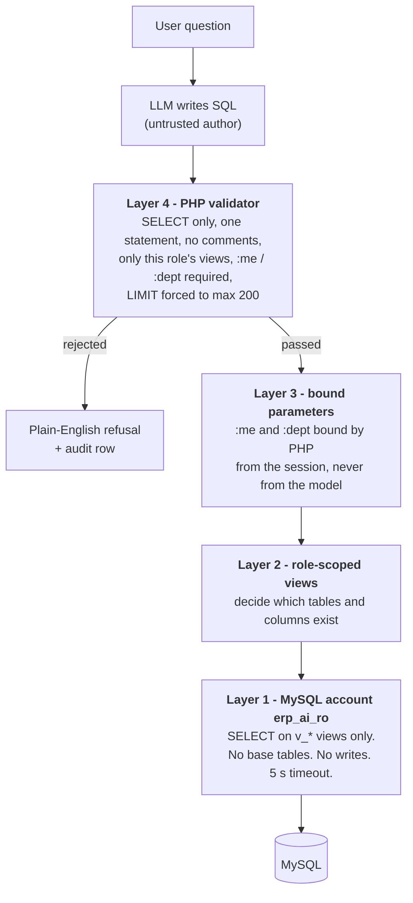

# Demo ERP + AI assistant

A deliberately small ERP (10 employees, 4 departments) with a chat assistant bolted on.
It exists to demonstrate one architecture:

> An employee asks a question in plain English. The AI writes the SQL **itself** (there
> is no library of pre-written queries), but that SQL can only ever run against
> **role-scoped, read-only database views**, through a MySQL account that holds
> `SELECT` on those views **and nothing else**.

Two kinds of question work:

| Kind | Example | What happens |
|---|---|---|
| Information | "What's our leave policy?" | Answered from the company knowledge base. No database query. |
| Data | "How many leave days do I have left?" | The AI checks the user's role, writes SQL scoped to what that role may see, the server validates and runs it. |

And, most importantly, a **refusal** is a normal, clean outcome: an employee asking for
salary data gets *"You're not authorised to access salary information."* The rest of
this document explains why that refusal holds even if the AI misbehaves.

Stack: Yii 2 (basic template), PHP 8, MySQL 8. No Composer packages beyond Yii itself.
AI calls are plain `curl`. No LLM SDK, no vector database, no Node.

---

## Contents

1. [The security model](#the-security-model-four-layers)
2. [Why two MySQL accounts](#why-two-mysql-accounts)
3. [Why views cannot be parameterised, and how :me / :dept solve it](#why-views-cannot-be-parameterised-and-how-me--dept-solve-it)
4. [Roles and what each can see](#the-five-roles)
5. [Request flow](#request-flow)
6. [Why no vector store](#why-no-vector-store)
7. [Known limitations](#known-limitations)
8. [Setup](#setup)
9. [Demo script](#demo-script)
10. [Verifying it yourself](#verifying-it-yourself)
11. [Where things live](#where-things-live)

---

## The security model: four layers

Each layer assumes the one above it has failed.



### Layer 1: two MySQL accounts

| Account | Privileges | Used by |
|---|---|---|
| `erp_app` | All privileges on the `erp_demo` schema | The application itself, and migrations |
| `erp_ai_ro` | `SELECT` on the 20 `v_*` views. **Nothing else.** | Only the code path that executes AI-generated SQL |

This is the output of `SHOW GRANTS FOR 'erp_ai_ro'@'127.0.0.1'`:

```
GRANT USAGE ON *.* TO `erp_ai_ro`@`127.0.0.1`
GRANT SELECT ON `erp_demo`.`v_dept_attendance` TO `erp_ai_ro`@`127.0.0.1`
GRANT SELECT ON `erp_demo`.`v_dept_employees` TO `erp_ai_ro`@`127.0.0.1`
... (one line per view, 20 in total) ...
GRANT SELECT ON `erp_demo`.`v_team_leave_requests` TO `erp_ai_ro`@`127.0.0.1`
```

`USAGE` means "may log in"; it grants nothing. There is no line for `employees`,
`salaries` or any other base table, and no `INSERT`, `UPDATE`, `DELETE`, `CREATE`,
`DROP`, `FILE` or `PROCESS` anywhere.

**How can erp_ai_ro read a view over tables it cannot touch?** MySQL views default to
`SQL SECURITY DEFINER`. A view runs with the privileges of the user who **created** it
(`erp_app`), not the user who **queries** it. So `erp_ai_ro` can read exactly what each
view exposes, and nothing more. That one MySQL behaviour is what makes this design work.
The migration sets `SQL SECURITY DEFINER` explicitly rather than relying on the default.

In the application these are two Yii connection components, `db` and `dbAi`
([config/db.php](config/db.php), [config/db-ai.php](config/db-ai.php)). `dbAi` also sets,
per session:
- `MAX_EXECUTION_TIME = 5000` (any query running longer than 5 seconds is killed);
- `transaction_read_only = 1` (belt and braces; the grant is the real control);
- real server-side prepared statements, so parameters are bound by MySQL rather than
  pasted into the SQL text.

### Layer 2: role-scoped views

Views decide **which tables and which columns** a tier can reach. There is one set of
views per *authority tier*, not one per employee.

Salary lives in its own table (`salaries`), and **only three views join to it**:
`v_hr_employees_full`, `v_hr_payroll` and `v_exec_payroll_summary`. Employee, manager and
department-head views never touch that table, so there is no salary column sitting next
to harmless columns waiting to be selected by mistake.

### Layer 3: bound parameters for row scoping

A view decides columns. It cannot decide *whose* rows. See
[the next section](#why-views-cannot-be-parameterised-and-how-me--dept-solve-it).

### Layer 4: the query validator

[components/ai/SqlValidator.php](components/ai/SqlValidator.php) runs before **every**
execution. It tokenises the SQL properly (string literals, quoted identifiers, numbers,
keywords and placeholders are separated first), so it is not fooled by, for example, the
text `FROM salaries` inside a quoted string. A query is rejected unless **all** of these
hold:

- Exactly one statement. An optional trailing `;` is allowed; any other `;` is rejected.
- It begins with `SELECT`. `INSERT`, `UPDATE`, `DELETE`, `DROP`, `ALTER`, `CREATE`,
  `TRUNCATE`, `GRANT`, `SET`, `CALL`, `LOAD`, `HANDLER`, `REPLACE`, `WITH`, `TABLE`,
  `INTO` and similar are rejected wherever they appear.
- No comments (`--`, `#`, `/* */`), no `@variables`, no `?` placeholders.
- Every table named after `FROM`, `JOIN` or `,` is on **this role's allowlist**.
  Schema-qualified names, `INFORMATION_SCHEMA`, `mysql.*`, table functions and
  parenthesised table lists are rejected.
- Timing and environment functions (`SLEEP`, `BENCHMARK`, `LOAD_FILE`, `USER()`...) are
  rejected.
- A self-scoped view must be filtered `employee_id = :me` (a team view,
  `manager_id = :me`), and a department view `department_id = :dept`.
- A `LIMIT` must be present. If it is missing, `LIMIT 200` is appended; if it is larger
  than 200, it is rewritten down to 200.

On rejection the user sees a plain-English sentence such as *"You're not authorised to
access salary information."* The technical reason goes to the audit log only. Raw SQL
errors are never shown to the user, and never sent back to the model either (it gets a
generic hint when a query needs fixing).

The single source of truth for "which role may use which view, with which scope" is
[config/access-map.php](config/access-map.php). Both the validator and the prompt builder
read it.

---

## Why two MySQL accounts

Because the AI's SQL is **untrusted input**, even after validation. The validator is PHP
code written for this demo, and it could have a bug. The MySQL grant is enforced by the
database server, and it holds no matter what PHP does.

With one account, a validator bug would be a data breach. With two, a validator bug means
MySQL answers `ERROR 1142: SELECT command denied to user 'erp_ai_ro' for table
'salaries'`. You can see this directly (the command below skips the validator on purpose):

```
php yii security/raw "SELECT AVG(basic) FROM salaries"
  As erp_ai_ro@127.0.0.1, validator BYPASSED:
  MySQL REFUSED it: SELECT command denied to user 'erp_ai_ro'@'localhost' for table 'salaries' (error 1142)
```

---

## Why views cannot be parameterised, and how :me / :dept solve it

A MySQL view takes no parameters. `v_my_leave_balance` contains **every** employee's
balance rows: nothing inside a view definition can mean "the person who is asking". So
the two jobs are split:

| Job | Done by |
|---|---|
| Which **columns and tables** a tier may see | The **view** (for example, no salary column in any employee-tier view) |
| Which **rows** belong to the asker | A **bound parameter** from the logged-in session |

The model is told to write placeholders, never ids:

```sql
SELECT leave_type, remaining
FROM v_my_leave_balance
WHERE employee_id = :me AND year = YEAR(CURDATE())
```

PHP then binds `:me` to the logged-in employee's id and `:dept` to their department id,
both **taken from the server-side session** (the `Employee` record Yii loads from the
session cookie). The value never comes from anything the model produced and is never
interpolated into the SQL string. The model is never even told the user's id.

**Defence in depth.** Requiring `:me` to be present is not enough by itself:
`WHERE employee_id = :me OR 1=1` contains `:me` and would still return everyone's rows.
So the validator also rewrites every scoped view into a derived table that applies the
scope itself:

```sql
-- what the model wrote
SELECT DISTINCT employee_id FROM v_my_attendance WHERE employee_id = :me OR 1=1

-- what actually runs on dbAi (the model's WHERE is kept, but no longer matters)
SELECT DISTINCT employee_id
FROM (SELECT * FROM `v_my_attendance` WHERE `employee_id` = :me) AS `v_my_attendance`
WHERE employee_id = :me OR 1=1 LIMIT 200
```

Whatever the model writes, a self-scoped view only ever returns the asker's own rows.
The test suite checks exactly this case.

---

## The five roles

These are five genuinely different scopes, not five labels on the same query.

| Role | Rows | Salary? | Views |
|---|---|---|---|
| `employee` | Own rows only (`employee_id = :me`) | No | directory + `v_my_*` |
| `manager` | Own rows + direct reports (`manager_id = :me`) | No | + `v_team_*` |
| `dept_head` | Whole own department (`department_id = :dept`) | No | directory + `v_my_*` + `v_dept_*` (incl. leave summary) |
| `hr` | All employees | **Yes** | directory + `v_my_*` + `v_hr_*` |
| `ceo` | Everything HR can see | **Yes** | + `v_exec_*` company-wide aggregates |

- `employee` and `manager` differ by **predicate** (`:me` on `employee_id` vs on `manager_id`).
- `manager` and `dept_head` differ by **predicate** (`manager_id` vs `department_id`).
- `hr` and `ceo` differ from all three by **having salary columns at all**.

Roles are a plain `role` column on `employees` plus the PHP map in
[config/access-map.php](config/access-map.php). Yii's RBAC is deliberately not used: for
10 employees it would add tables and files without strengthening anything, because the
real boundary is the MySQL grant.

---

## Request flow

`POST /index.php?r=chat/ask` → [controllers/ChatController.php](controllers/ChatController.php)
→ [components/ai/ChatService.php](components/ai/ChatService.php)

1. **Who is asking** comes from the session. The request body carries only the question
   text; the tests confirm that adding `"role": "ceo"` to the body changes nothing.
2. **The system prompt is built for that role**
   ([PromptBuilder](components/ai/PromptBuilder.php)). It contains:
   - all `company_info` rows;
   - the column list of **only** the views this role may use;
   - the SQL rules: `SELECT` only, one statement, `:me` / `:dept`, `LIMIT`, MySQL dialect.

   An employee's prompt contains no salary column and no HR view, so the model cannot even
   see what to ask for. (`php yii security/prompt dev1@demo.local` prints the exact prompt.)
3. **The model is called with two tools**: `getUserRole()` and `runReadOnlyQuery(sql)`.
4. **No tool call** means an information answer. If the model instead answers
   `ACCESS_DENIED: <subject>` (it saw no permitted view for the request), the server turns
   that into the standard refusal. No SQL was ever generated.
5. **`getUserRole`** returns the session role. To be clear, this is **not a security
   control**. The backend already knows the role and enforces it in layers 1 to 4. The tool
   exists so the role check is visible and traceable in the demo, and because in production
   the chatbot may run as a separate service that genuinely needs to ask.
6. **`runReadOnlyQuery`** validates, binds `:me` / `:dept` from the session, and executes
   on `dbAi`. The rows go back to the model, which phrases the answer. A **refusal ends the
   turn immediately**, and the wording comes from the server, not the model. A query that
   fails to execute (for example an unknown column) gets a generic hint and up to 2 retries.
7. **Exactly one `chat_audit_log` row per turn**, whatever happened: `info`, `data`,
   `denied` or `error`, with the generated SQL, denial reason, row count, latency, provider
   and model. `employee_id` has no foreign key, so audit rows survive employee deletion.

**AI provider.** Primary is Google Gemini (`gemini-2.5-flash`, free tier). Fallback is
Groq `openai/gpt-oss-120b` (free, OpenAI-compatible API). The choice is one line in
`config/ai.php`. Temperature is 0, so the same question gives the same SQL on the
projector. The Gemini client uses the REST `generateContent` API and sends the model's
previous turn back exactly as received (including `thoughtSignature`), which is required
for newer Gemini models' function calling.

---

## Why no vector store

The knowledge base is about 15 short rows. Putting all of it in the prompt is **cheaper,
simpler and more accurate** than embeddings at this size: nothing to index, nothing to
tune, and no retrieval step that can miss the relevant paragraph.

The chat interface does not depend on how knowledge is retrieved. Swapping in a vector
store later (when the knowledge base is thousands of documents) would change only
`PromptBuilder::knowledgeBase()`, not the chat flow, the tools, or the security layers.

---

## Known limitations

Stated plainly rather than hidden:

1. **Free-tier AI data use.** On free tiers, Google and Groq may use submitted prompts
   and responses to improve their models. That is acceptable for this demo because every
   name, salary and record is fabricated. With real employee data it is a **blocker**:
   production needs a paid tier with a no-training data agreement, or a self-hosted model.
   Note that the prompt contains the knowledge base, the view schema and the returned
   rows, so real salary data would be sent to the provider.
2. **Small-group aggregates are individual disclosure.** "Average salary" over a group of
   one or two people reveals those people's pay. In this seed data, Executive and HR each
   have **one** person. Future work: a minimum-group-size rule (for example, suppress any
   aggregate over fewer than 5 people) enforced in the aggregate views or the validator.
3. **Tier separation between views is enforced by the validator, not by MySQL.** There is
   one `erp_ai_ro` account for all roles, holding `SELECT` on every view. MySQL guarantees
   that **no role can reach a base table or write anything**; it is the PHP validator that
   stops, say, an employee's query from using `v_hr_payroll`. Hardening step: one MySQL
   account per tier (`erp_ai_employee`, `erp_ai_hr`, ...), each granted only its own
   views, so that the database enforces that boundary too.
4. **The validator is a conservative allowlist, not a full SQL parser.** It rejects
   anything it does not understand (CTEs, parenthesised table lists, variables...). Rare
   but legitimate queries may be refused. That trade-off is intentional.
5. **Prompt injection.** A user can try to talk the model into writing other SQL. That can
   change *which* SQL is attempted, but not *what can run*: layers 1 to 4 do not trust the
   model at all. The test suite includes a deliberately malicious scripted "model".
6. **The demo role switcher** (become any user without a password) is a demo convenience
   controlled by `params['demoRoleSwitcher']` in [config/params.php](config/params.php).
   Turn it off for anything else.
7. **Gemini model availability.** Google now restricts `gemini-2.5-*` to accounts that
   have used it before. If a new key gets "model not available", set the model in
   `config/ai.php` to `gemini-3.8-flash`, or switch `provider` to `groq`.
8. **Rate limits.** Free tiers throttle. A throttled request produces a clean "try again
   in a minute" message and an `error` audit row, not a crash.

---

## Setup

Prerequisites: PHP 8.x with `pdo_mysql`, `mbstring`, `openssl`, `curl`, `intl`; MySQL 8;
Composer.

```bash
# 1. Dependencies (Yii only)
composer install

# 2. Local settings. In THIS demo repo, config/db-local.php and config/ai.php are committed
#    on purpose so every device can pull and run (fabricated data only). In a real project
#    they would be gitignored and created from the *.example templates:
#    cp config/db-local.php.example config/db-local.php   # set passwords + cookie key
#    cp config/ai.php.example      config/ai.php
#    The API KEY is never committed: put it in the gitignored config/ai-local.php
cp config/ai-local.php.example config/ai-local.php     # paste your Gemini (or Groq) API key

# Steps 3-5 in one go:  php yii setup/database <mysql-root-password>

# 3. Database + privileged account - run ONCE as MySQL root
#    (replace __ERP_APP_PASSWORD__ with the 'app' password from db-local.php)
mysql -u root -p < sql/00-bootstrap.sql

# 4. Schema, seed data and views
php yii migrate

# 5. The restricted AI account - run as MySQL root AFTER migrating
#    (replace __ERP_AI_RO_PASSWORD__ with the 'ai' password from db-local.php)
mysql -u root -p < sql/01-ai-readonly-user.sql

# 6. Run
php yii serve localhost:8080
#    open http://localhost:8080 - every demo account's password is Demo@1234
```

**`localhost` vs `127.0.0.1`.** MySQL treats `'user'@'localhost'` and
`'user'@'127.0.0.1'` as **different accounts**. Both SQL scripts create both. Use
whichever host string actually authenticates in `db-local.php` (here it is `127.0.0.1`,
over TCP). If you get "access denied" over TCP with a correct password, look for an
anonymous `''@'localhost'` row in `mysql.user` taking precedence.

**Windows / HTTPS.** PHP on Windows often has no CA bundle, which breaks HTTPS to the AI
provider. The client uses the Windows certificate store (`CURLSSLOPT_NATIVE_CA`) and keeps
TLS verification on. Set `caBundle` in `config/ai.php` if you need a specific
`cacert.pem`.

**Refreshing demo dates.** Leave requests and attendance are dated relative to the day the
seed ran. Right before the demo, run `php yii migrate/redo 2` (views + seed) so the
"pending" requests are still in the future. The numbers stay the same (fixed random seed).

---

## Demo script

All five must work end to end. `php yii verify/demo` runs them live against the
configured provider.

| # | Sign in as | Ask | Expected |
|---|---|---|---|
| 1 | `dev1@demo.local` (Employee) | "what's our leave policy?" | **Info path.** Answered from the knowledge base. No SQL. |
| 2 | `dev1@demo.local` | "how many leave days do I have left?" | **Data path.** `v_my_leave_balance`, `:me` bound to dev1. Annual 16 of 20. |
| 3 | `dev1@demo.local` | "what's the average salary in engineering?" | **Refused**: "You're not authorised to access salary information." |
| 4 | `enghead@demo.local` (Dept Head) | "who on my team has pending leave?" | **Data path.** `v_dept_leave_requests`, `:dept` bound to Engineering. 5 pending requests (Arif ×2, Sadia, Rakibul, Farhana). |
| 5 | `hr@demo.local` (HR) | the exact question from #3 | **Answered**: BDT 218,400 average gross monthly salary across 5 engineers. |

**#3 and #5 are the same sentence with different outcomes. That is the whole point.**

Suggested talking points for #3:

1. Turn on **"Show generated SQL"**. The refusal card says *"The model found no permitted
   view for this and generated no SQL"*.
2. Open **Security test bench** as dev1 and expand "System prompt the AI receives for this
   role". There is no salary column in it anywhere: the model cannot write a query for
   something it was never told exists.
3. On the bench, run the preset **"Average salary in Engineering"**. Even if the model
   *had* guessed the HR view name, the validator refuses it.
4. In a terminal, `php yii security/raw "SELECT AVG(basic) FROM salaries"`. Even if the
   validator had a bug, **MySQL itself** refuses (error 1142).
5. Show `SHOW GRANTS FOR 'erp_ai_ro'@'127.0.0.1';`: only view grants.
6. Open **Audit log**: the refusal was recorded with its reason.

Use the **Switch user** menu (top right) to change identity in two clicks.

---

## Verifying it yourself

Repeatable checks, one per build phase. Start the server first (`php yii serve`); the
HTTP checks drive it like a browser.

```bash
php yii verify/all      # phases 1-6, no AI key needed (the AI is replaced by a scripted stand-in)
php yii verify/phase4   # just the permission layer: allowed / refused / :me / LIMIT / injection cases
php yii verify/demo     # the five demo questions LIVE against the configured AI provider

php yii security/prompt dev1@demo.local                        # exact system prompt for a user
php yii security/check  dev1@demo.local "SELECT ... :me ..."   # validator + dbAi as that user
php yii security/raw    "SELECT AVG(basic) FROM salaries"      # bypass validator: MySQL alone
```

`verify/phase5` includes a **malicious scripted model** that tries base tables, guessed HR
views, `OR 1=1`, missing `:me` and `DELETE`. All are refused or neutralised by the server.

---

## Where things live

| Path | What |
|---|---|
| [config/access-map.php](config/access-map.php) | Role → allowed views → required scope. Single source of truth. |
| [config/db.php](config/db.php), [config/db-ai.php](config/db-ai.php) | The two connections (`db` = erp_app, `dbAi` = erp_ai_ro) |
| `config/db-local.php`, `config/ai.php` | Local secrets, gitignored (`*.example` files are committed) |
| [sql/](sql/) | Bootstrap and restricted-account scripts, run manually as root |
| [migrations/](migrations/) | Schema (3), seed data (1), views (1) |
| [components/ai/SqlValidator.php](components/ai/SqlValidator.php) | Layer 4 |
| [components/ai/QueryExecutor.php](components/ai/QueryExecutor.php) | Layer 3: binds :me / :dept from the session, runs on dbAi |
| [components/ai/QueryGateway.php](components/ai/QueryGateway.php) | The one path from any SQL (AI or test bench) to the database |
| [components/ai/PromptBuilder.php](components/ai/PromptBuilder.php) | Role-specific system prompt |
| [components/ai/ChatService.php](components/ai/ChatService.php) | One chat turn: tools, loop, refusal handling, audit |
| [components/ai/provider/](components/ai/provider/) | Gemini and Groq clients (curl), scripted test provider |
| [controllers/ChatController.php](controllers/ChatController.php) | Chat UI, `ask` endpoint, audit page |
| [controllers/SecurityTestController.php](controllers/SecurityTestController.php) | Hand-written-SQL test bench (no AI) |
| [commands/VerifyController.php](commands/VerifyController.php) | `php yii verify/*` acceptance checks |
